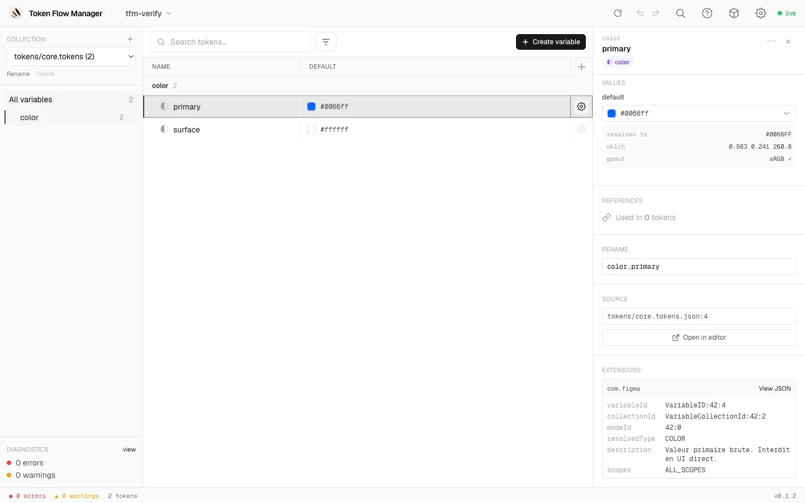

# Features

## Project management

- **Welcome screen**: recent projects (removable with ×) plus a native folder picker
  ("Browse your computer…") with a paste-a-path fallback. Open a project from the UI,
  no path on the command line.
- **Project switcher**: the header shows the open project's name with a chevron; the
  dropdown switches to a recent project in place or returns to the welcome screen.

## Editing tokens

- **Variables table**: mode columns (light/dark/brand and more), alias chips, inline
  editing, resizable columns.
- **Sidebar group tree**: Finder-style drag-and-drop. Drop a group onto another to
  **nest** it, or between two groups to **reorder**. Multi-select with ⌘/Ctrl-click and
  Shift-click to move several at once.
- **Copy / Cut / Paste variables** (++cmd+c++ / ++cmd+x++ / ++cmd+v++): cut hides the
  rows immediately and moves them on paste; copy duplicates.
- **Undo / redo** (++cmd+z++ / ++cmd+shift+z++): byte-exact and server-side.

## Finding & fixing

- **Search** (++cmd+s++) and filters: aliases, deprecated, orphans, errors, plus a
  **command palette**.
- **Diagnostics** with one-click quick-fixes.
- **Inspector** with alias chains and incoming references.
- **Keyboard shortcuts help** (++cmd+slash++ or ++question++) and the app version in the
  footer.

## Inspector & extensions

Open a token's detail panel with the **gear icon** on its row. It shows the description,
per-mode values (with resolved colour, OKLCH and gamut), incoming references, rename, and
the source file location.

When a token carries DTCG **`$extensions`** — for example the `com.figma` block exported
by Figma (variable id, collection id, mode id, resolved type, scopes…) — it is preserved
on read and shown in a dedicated **Extensions** section. Each vendor block is rendered as
readable key/value rows, with a **View JSON** toggle for the raw payload. Extensions are
kept intact through edits and writes.

## Safety model

!!! info "It never commits"

    Token Flow Manager edits the source JSON **in place**, atomically, preserving key
    order and formatting. The server stays local to your machine, watches files for
    changes, and keeps rotating backups on write.

- [x] Format-preserving, atomic writes
- [x] Alias resolution across collections and modes (cycles, broken refs detected)
- [x] DTCG 2025.10 compliant
- [x] Local-only, nothing leaves your machine
