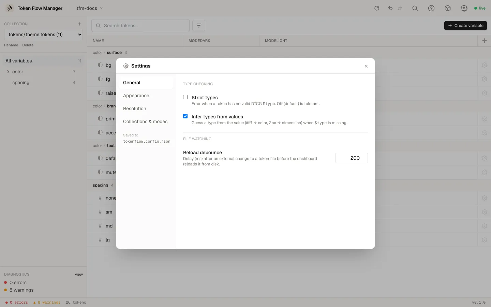
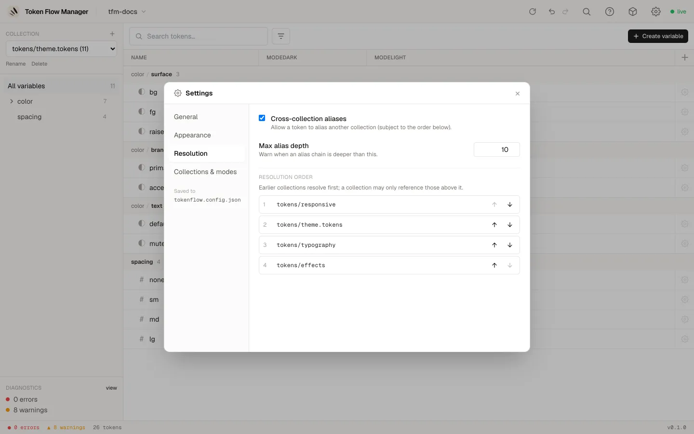

# Settings

Open settings from the **gear icon** in the top-right of the header. Settings are
grouped into four tabs.

## General

Type checking and file watching. Saved to `tokenflow.config.json`.

- **Strict types**: raise an error when a token has no valid DTCG `$type`. Off by
  default (tolerant).
- **Infer types from values**: guess a type from the value (`#fff` to color, `2px` to
  dimension) when `$type` is missing.
- **Reload debounce (ms)**: delay after an external change to a token file before the
  dashboard reloads it from disk.

## Appearance

Pick the dashboard accent colour. This preference is stored in your browser, per
device, and applies instantly.

## Resolution

How aliases resolve across your collections. Saved to `tokenflow.config.json`.

- **Cross-collection aliases**: allow a token to alias another collection.
- **Max alias depth**: warn when an alias chain is deeper than this.
- **Resolution order**: reorder collections with the up/down arrows. Earlier
  collections resolve first; a collection may only reference those above it.

## Collections & modes

Describe your collections, their modes (the value columns, e.g. Light/Dark,
Desktop/Tablet) and which files feed each mode. This is the source of truth for how the
tool reads your tokens, and it is saved to `manifest.json`.

For each collection you can rename modes, choose which nesting level is the mode
dimension, or keep the tokens as plain nested groups. Use **Open manifest.json** to edit
the file directly.
