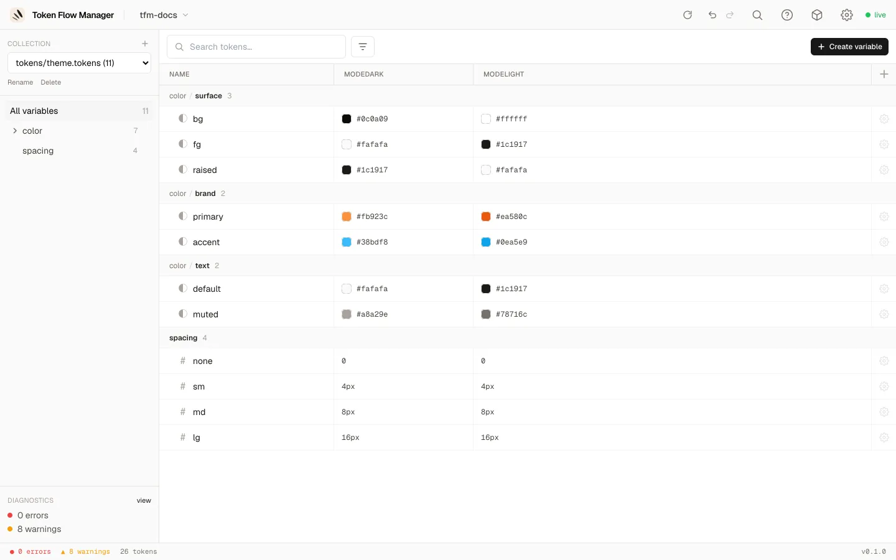
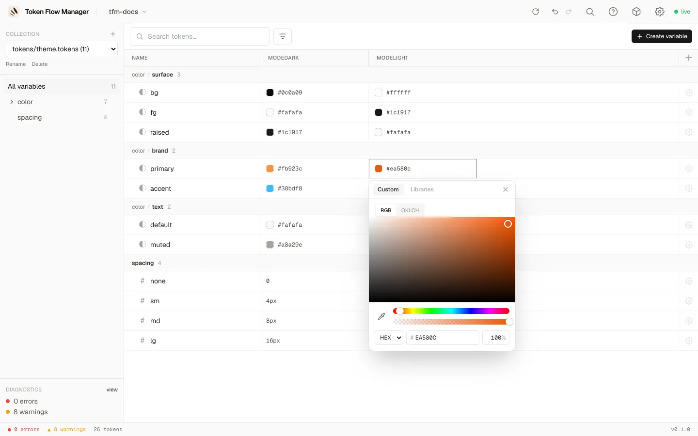
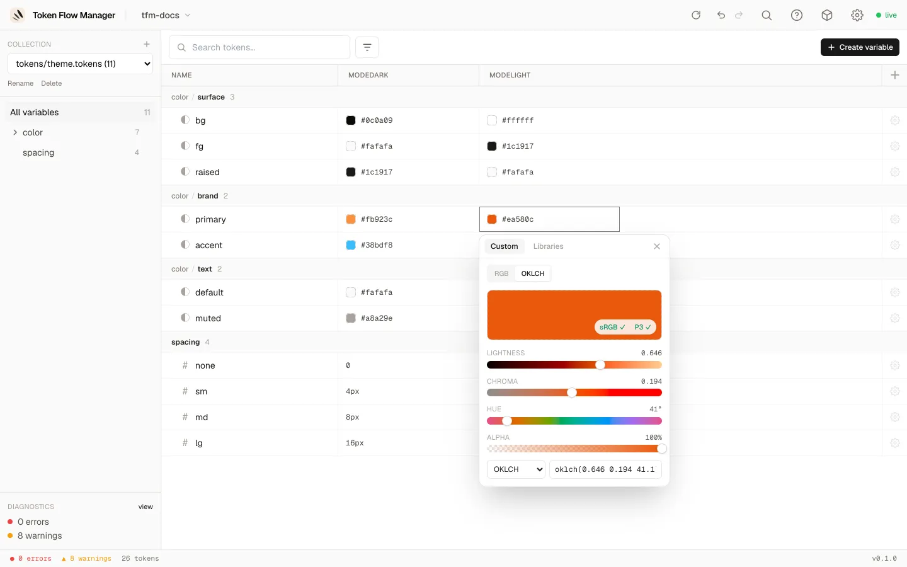
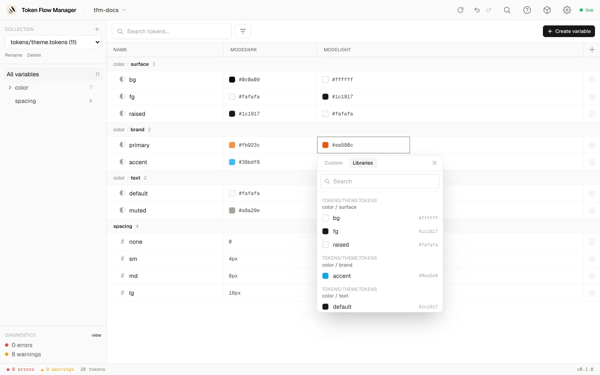
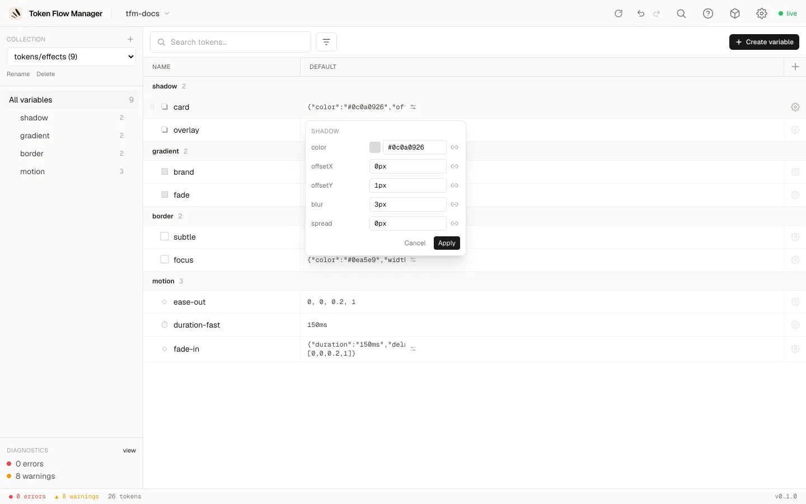
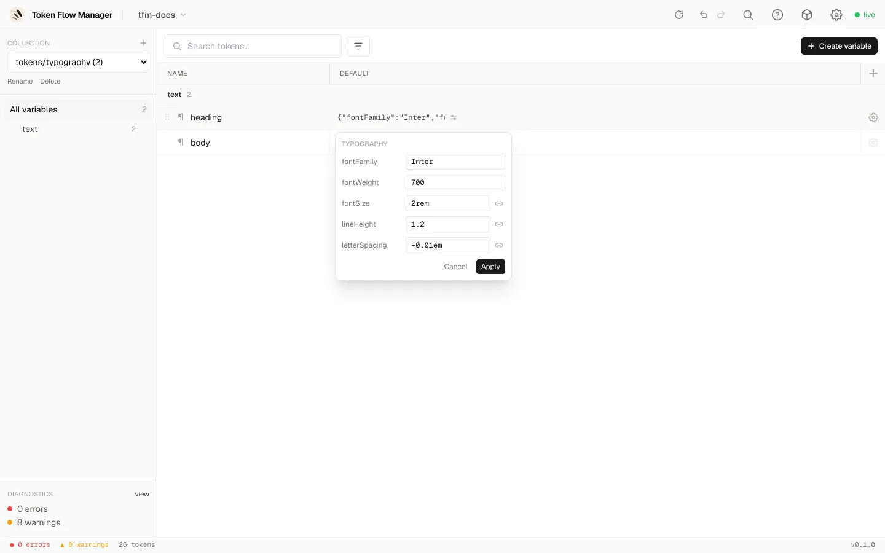

# Token types & pickers

Token Flow Manager understands the DTCG token types and gives each one a fitting editor,
from a simple text field to a full colour picker or a structured editor for composite
tokens.

## Simple types

Edited inline in the table (double-click a cell, or press Enter on a focused cell):

| Type | Editor |
|---|---|
| `color` | Colour picker (see below) |
| `dimension`, `number` | Text input with ↑/↓ steppers |
| `fontFamily`, `fontWeight`, `duration` | Text input |
| `cubicBezier` | Four numbers `[x1, y1, x2, y2]` |
| `strokeStyle` | Text / select |

## Colour picker

Click any colour cell to open the picker. It has two tabs: **Custom** (enter your own
value) and **Libraries** (alias another token).

=== "RGB"

    Saturation/value square, hue and alpha sliders, an eyedropper, and HEX or RGB input.

    

=== "OKLCH"

    Lightness, chroma and hue sliders with live sRGB / P3 gamut badges, and output as
    OKLCH, Display P3 or HEX.

    

=== "Libraries (alias)"

    Search and pick another token to alias. Colour tokens show a swatch and their
    resolved value.

    

## Composite tokens

Composite tokens (objects or arrays) get a structured **expand-in-place** editor. Click
the **sliders icon** on a composite cell. Each field gets the right control: colour
fields open the colour picker, dimensions and numbers are text inputs, and you can alias
individual fields.

=== "Shadow"

    `color`, `offsetX`, `offsetY`, `blur`, `spread`.

    

=== "Gradient"

    A preview bar and a list of colour stops (colour + position), with **Add stop**.

    

=== "Typography"

    `fontFamily`, `fontWeight`, `fontSize`, `lineHeight`, `letterSpacing` and more. Any
    field can be a literal or an alias.

    

`border` and `transition` work the same way, each with their own fields.
