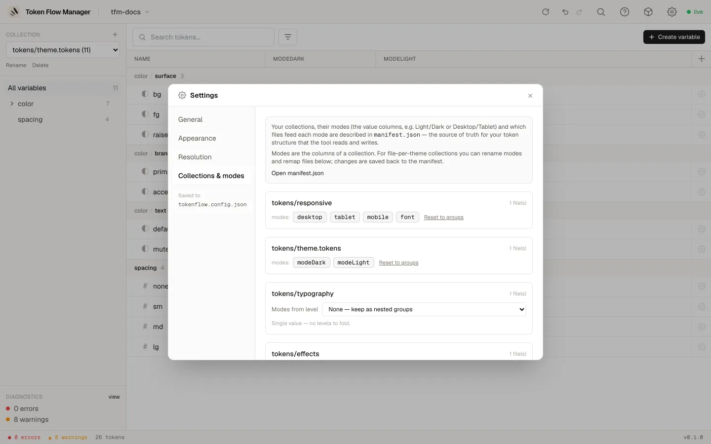

# Réglages

Ouvrez les réglages depuis l'**icône engrenage** en haut à droite du header. Les
réglages sont organisés en quatre onglets.

## Général

Vérification des types et surveillance des fichiers. Enregistré dans
`tokenflow.config.json`.

- **Strict types** : lève une erreur quand un token n'a pas de `$type` DTCG valide.
  Désactivé par défaut (tolérant).
- **Infer types from values** : devine un type à partir de la valeur (`#fff` vers color,
  `2px` vers dimension) quand le `$type` est absent.
- **Reload debounce (ms)** : délai après une modification externe d'un fichier de tokens
  avant que le dashboard ne le recharge depuis le disque.

## Apparence

Choisissez la couleur d'accent du dashboard. Cette préférence est stockée dans votre
navigateur, par appareil, et s'applique instantanément.

## Résolution

Comment les alias se résolvent entre vos collections. Enregistré dans
`tokenflow.config.json`.

- **Cross-collection aliases** : autorise un token à référencer une autre collection.
- **Max alias depth** : avertit quand une chaîne d'alias dépasse cette profondeur.
- **Resolution order** : réordonnez les collections avec les flèches haut/bas. Les
  collections du haut se résolvent en premier ; une collection ne peut référencer que
  celles au-dessus d'elle.

## Collections & modes

Décrivez vos collections, leurs modes (les colonnes de valeurs, par ex. Clair/Sombre,
Desktop/Tablet) et quels fichiers alimentent chaque mode. C'est la source de vérité pour
la façon dont l'outil lit vos tokens, et c'est enregistré dans `manifest.json`.

Pour chaque collection vous pouvez renommer les modes, choisir quel niveau
d'imbrication est la dimension de mode, ou garder les tokens comme de simples groupes
imbriqués. Utilisez **Open manifest.json** pour éditer le fichier directement.
