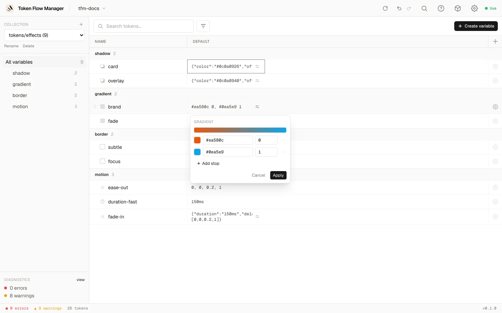

# Types de tokens & pickers

Token Flow Manager comprend les types de tokens DTCG et donne à chacun un éditeur
adapté, du simple champ texte au picker de couleur complet, ou à un éditeur structuré
pour les tokens composites.

## Types simples

Édités en ligne dans le tableau (double-clic sur une cellule, ou Entrée sur une cellule
sélectionnée) :

| Type | Éditeur |
|---|---|
| `color` | Picker de couleur (voir plus bas) |
| `dimension`, `number` | Champ texte avec incréments ↑/↓ |
| `fontFamily`, `fontWeight`, `duration` | Champ texte |
| `cubicBezier` | Quatre nombres `[x1, y1, x2, y2]` |
| `strokeStyle` | Texte / liste déroulante |

## Picker de couleur

Cliquez sur une cellule de couleur pour ouvrir le picker. Il a deux onglets : **Custom**
(saisir votre propre valeur) et **Libraries** (référencer un autre token).

=== "RGB"

    Carré saturation/valeur, curseurs de teinte et d'alpha, une pipette, et saisie HEX
    ou RGB.

    

=== "OKLCH"

    Curseurs de luminosité, chroma et teinte avec badges de gamut sRGB / P3 en direct,
    et sortie en OKLCH, Display P3 ou HEX.

    

=== "Libraries (alias)"

    Recherchez et choisissez un autre token à référencer. Les tokens couleur affichent
    une pastille et leur valeur résolue.

    

## Tokens composites

Les tokens composites (objets ou tableaux) ont un éditeur structuré **déplié sur
place**. Cliquez sur l'**icône curseurs** d'une cellule composite. Chaque champ reçoit
le bon contrôle : les champs couleur ouvrent le picker, les dimensions et nombres sont
des champs texte, et vous pouvez référencer chaque champ individuellement.

=== "Shadow"

    `color`, `offsetX`, `offsetY`, `blur`, `spread`.

    

=== "Gradient"

    Une barre de prévisualisation et une liste de stops (couleur + position), avec
    **Add stop**.

    

=== "Typography"

    `fontFamily`, `fontWeight`, `fontSize`, `lineHeight`, `letterSpacing` et plus.
    Chaque champ peut être une valeur littérale ou un alias.

    

`border` et `transition` fonctionnent de la même façon, chacun avec ses propres champs.
