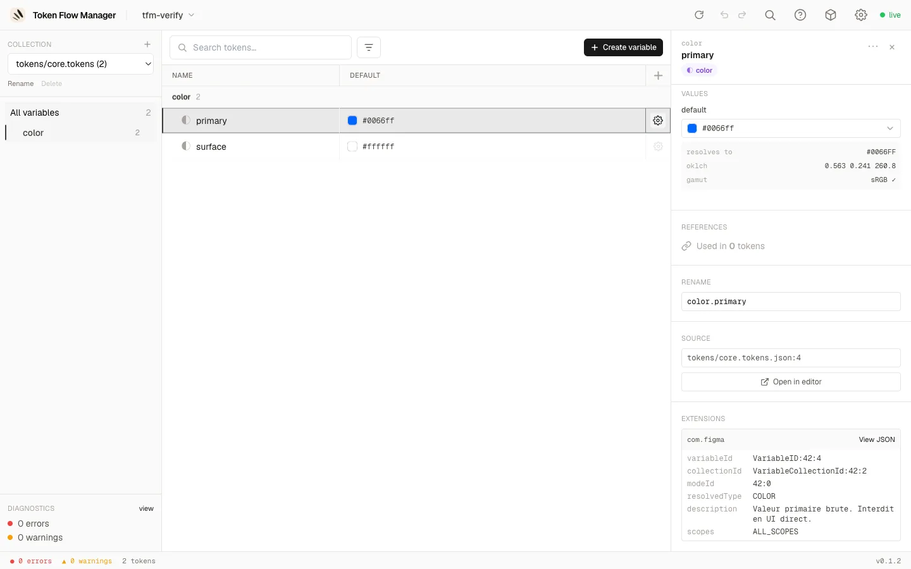

# Features

## Project management

- **Welcome screen**: recent projects (removable with ×) plus a native folder picker
  ("Browse your computer…") with a paste-a-path fallback. Open a project from the UI,
  no path on the command line.
- **Project switcher**: the header shows the open project's name with a chevron; the
  dropdown switches to a recent project in place or returns to the welcome screen.

## Editing tokens

- **Variables table**: mode columns (light/dark/brand and more), alias chips, inline
  editing, resizable columns.
- **Reorder mode columns**: drag a column header by its label to move it. Only the
  collection's mode order changes (the token files are untouched), and the leftmost
  mode is the collection's default.
- **Sidebar group tree**: Finder-style drag-and-drop. Drop a group onto another to
  **nest** it, or between two groups to **reorder**. Multi-select with ⌘/Ctrl-click and
  Shift-click to move several at once.
- **Copy / Cut / Paste variables** (++cmd+c++ / ++cmd+x++ / ++cmd+v++): cut hides the
  rows immediately and moves them on paste; copy duplicates.
- **Copy / Paste a value** (++cmd+c++ / ++cmd+v++ on a focused cell, or right-click →
  *Copy value* / *Paste value*): the cell value goes to the **system clipboard**, so it
  travels to another cell, another mode, or any other app. Pasting into a multi-selection
  fills every selected row at that mode in one go (one undo).
- **Undo / redo** (++cmd+z++ / ++cmd+shift+z++): byte-exact and server-side.

!!! tip "A pasted value is cleaned up and checked"

    Clipboard text is normalised (surrounding whitespace, line breaks, quotes and a
    trailing `;` are dropped) then validated against the cell's type: `1a2b3c` pastes as
    `#1a2b3c`, `1600` over `1440px` becomes `1600px` (it keeps the unit already in use),
    and `{screen.gutter}` re-links the cell to that token. A value that doesn't fit the
    type is refused with a reason instead of being written.

## Colour palettes (shading)

Generate and edit a full shaded scale (50 → 900) from a single base colour — no more
copy-pasting each step from an external tool.

Open the **palette editor** from the palette icon on a colour group's header. It detects
the group's steps, uses `500` as the base (or the middle step), and builds a
perceptually-even **OKLCH** ramp you tune live:

- **Base colour per mode**: each mode (light/dark, brands…) has its own anchor, picked
  with the app's colour picker; each mode's column is generated independently.
- **Steps**: click a chip to set the base, ++x++ to remove a step, or type a name to add
  one.
- **Ramp**: lightest / darkest lightness, chroma falloff (desaturation towards the
  extremes), hue shift, and the lightness distribution (linear / ease / …), with a live
  preview.
- **Generate** writes the step tokens; the base keeps its exact colour.

A step you edit by hand becomes **detached**: it is preserved on regenerate (its preview
is frozen too) until you re-link it. In the variables table, a group driven by a recipe
shows a **Palette** badge, the base step a ◆ marker, and generated steps a link icon.

!!! tip "Recipes survive a Figma round-trip"

    The shading recipe (base, steps, curve) is stored in `tokenflow.config.json` — a
    versioned, tool-only file that is **never sent to Figma**, so an export can't wipe it
    (Figma has no group entity to carry it). The generated steps themselves are ordinary,
    portable DTCG colour tokens.

## Finding & fixing

- **Search** (++cmd+s++) and filters: aliases, deprecated, orphans, errors, plus a
  **command palette**.
- **Diagnostics** with one-click quick-fixes.
- **Inspector** with alias chains and incoming references.
- **Keyboard shortcuts help** (++cmd+slash++ or ++question++) and the app version in the
  footer.

## Inspector & extensions

Open a token's detail panel with the **gear icon** on its row. It shows the description,
per-mode values (with resolved colour, OKLCH and gamut), incoming references, rename, and
the source file location.

When a token carries DTCG **`$extensions`** — for example the `com.figma` block exported
by Figma (variable id, collection id, mode id, resolved type, scopes…) — it is preserved
on read and shown in a dedicated **Extensions** section. Each vendor block is rendered as
readable key/value rows, with a **View JSON** toggle for the raw payload. Extensions are
kept intact through edits and writes.

## Safety model

!!! info "It never commits"

    Token Flow Manager edits the source JSON **in place**, atomically, preserving key
    order and formatting. The server stays local to your machine, watches files for
    changes, and keeps rotating backups on write.

- [x] Format-preserving, atomic writes
- [x] Alias resolution across collections and modes (cycles, broken refs detected)
- [x] DTCG 2025.10 compliant
- [x] Local-only, nothing leaves your machine
