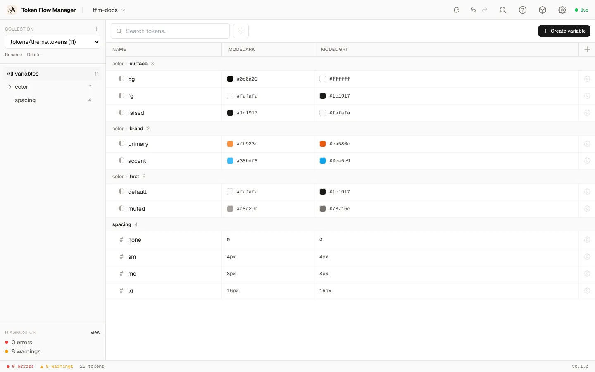
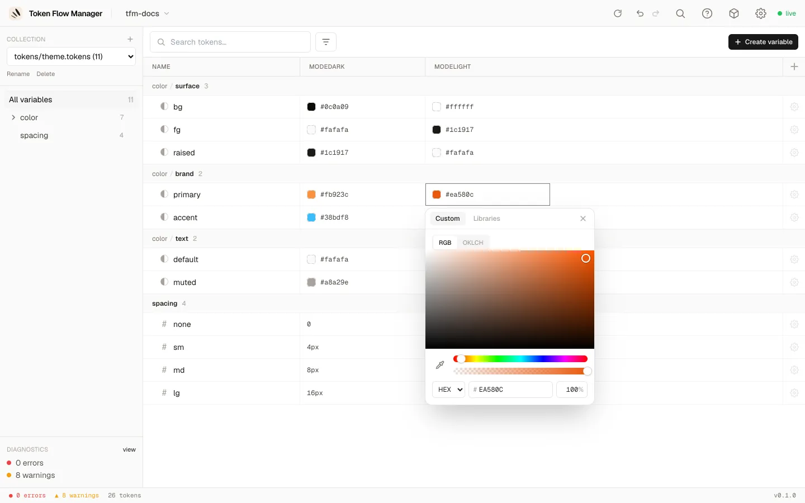
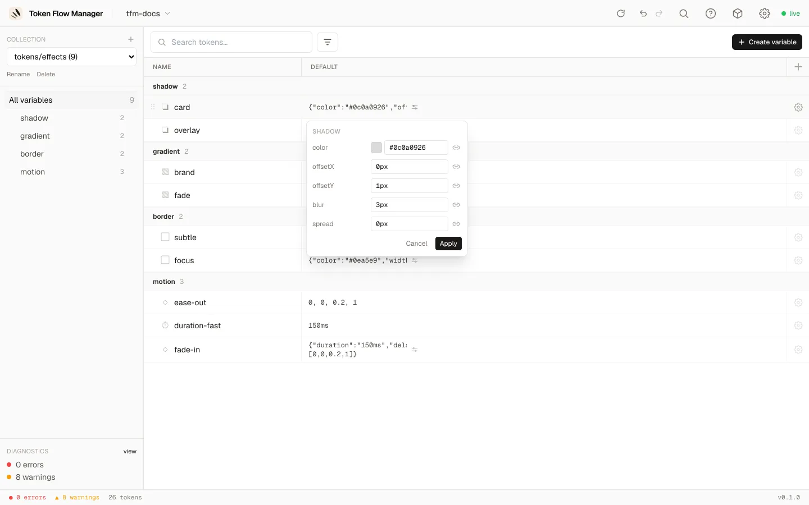
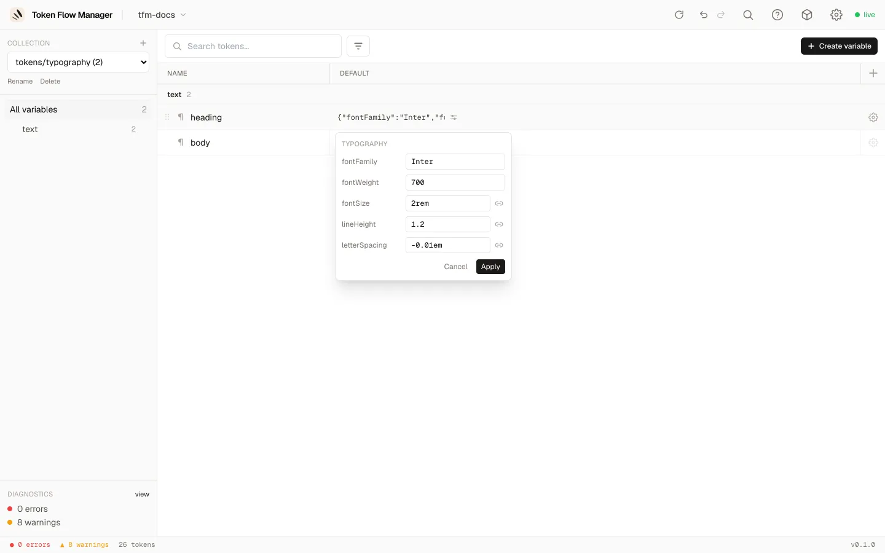

# Token types & pickers

Every token type gets a fitting editor, from a text field to a full colour picker or a
structured editor for composite tokens.

## Two dialects, one model

The same tokens ship in two JSON dialects, and both open the same way:

| On disk | Written by |
|---|---|
| `$value` / `$type` / `$description` | DTCG 2025.10, the spec |
| `value` / `type` / `description` | the Tokens Studio Figma plugin |

The dialect is detected per token, so a mixed file works too, and the diagnostics panel
tells you what was found. Two rules matter in practice:

- **A file is written back in its own dialect.** Editing a token in a Tokens Studio file
  rewrites that one `value` and nothing else, so the file keeps working with the Figma
  plugin. A token you create there is written the same way, under the name the plugin
  expects (`boxShadow`, not `shadow`).
- **Only type *names* are translated, never values.** `fontSizes` reads as `dimension`,
  `boxShadow` as `shadow`, `lineHeights` and `opacity` as `number`, `fontFamilies` and
  `fontWeights` as `fontFamily` and `fontWeight`. A shadow keeps its `x` / `y` / `spread`
  fields, a line height keeps `"150%"`. Names with no DTCG equivalent (`textCase`,
  `textDecoration`, `composition`, `asset`, `other`) stay untyped and untouched.

Arithmetic values such as `"{fontSize.base} * 0.75"` are kept verbatim rather than
evaluated, and the references inside them count as references: renaming `fontSize.base`
updates every expression pointing at it.

## Simple types

Edited inline in the table (double-click a cell, or press Enter on a focused cell):
`color` opens the colour picker, `dimension` and `number` a text input with ↑/↓ steppers,
`fontFamily`, `fontWeight`, `duration` and `strokeStyle` a text input, and `cubicBezier`
its four numbers `[x1, y1, x2, y2]`.

## Colour picker

Click any colour cell to open the picker. It has two tabs: **Custom** (enter your own
value) and **Libraries** (alias another token).

=== "RGB"

    Saturation/value square, hue and alpha sliders, an eyedropper, and HEX or RGB input.

    

=== "OKLCH"

    Lightness, chroma and hue sliders with live sRGB / P3 gamut badges, and output as
    OKLCH, Display P3 or HEX.

    

=== "Libraries (alias)"

    Search and pick another token to alias. Colour tokens show a swatch and their
    resolved value.

    

## Composite tokens

Composite tokens (objects or arrays) get a structured **expand-in-place** editor. Click
the **sliders icon** on a composite cell. Each field gets the right control: colour
fields open the colour picker, dimensions and numbers are text inputs, and you can alias
individual fields.

=== "Shadow"

    `color`, `offsetX`, `offsetY`, `blur`, `spread`.

    

=== "Gradient"

    A preview bar and a list of colour stops (colour + position), with **Add stop**.

    

=== "Typography"

    `fontFamily`, `fontWeight`, `fontSize`, `lineHeight`, `letterSpacing` and more. Any
    field can be a literal or an alias.

    

`border` and `transition` work the same way, each with their own fields.
