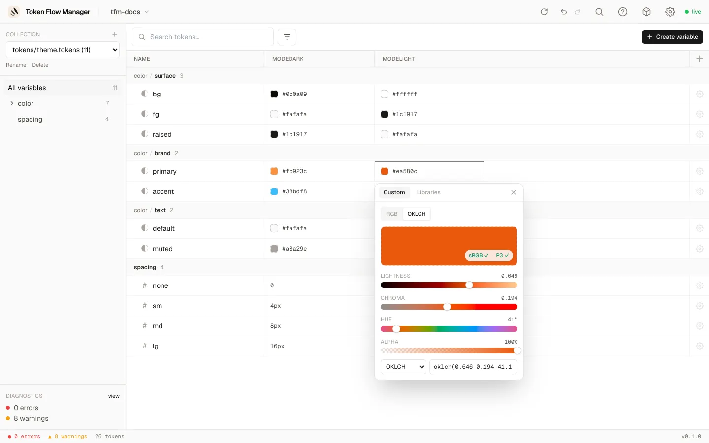
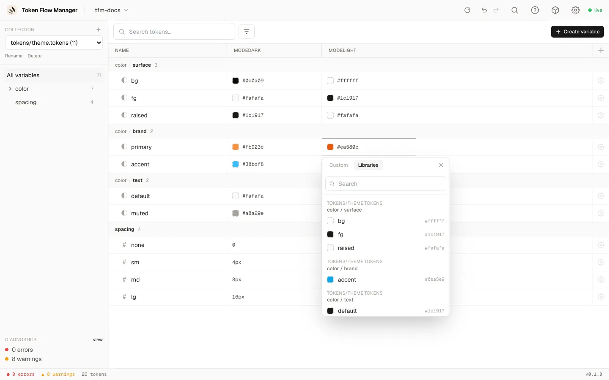
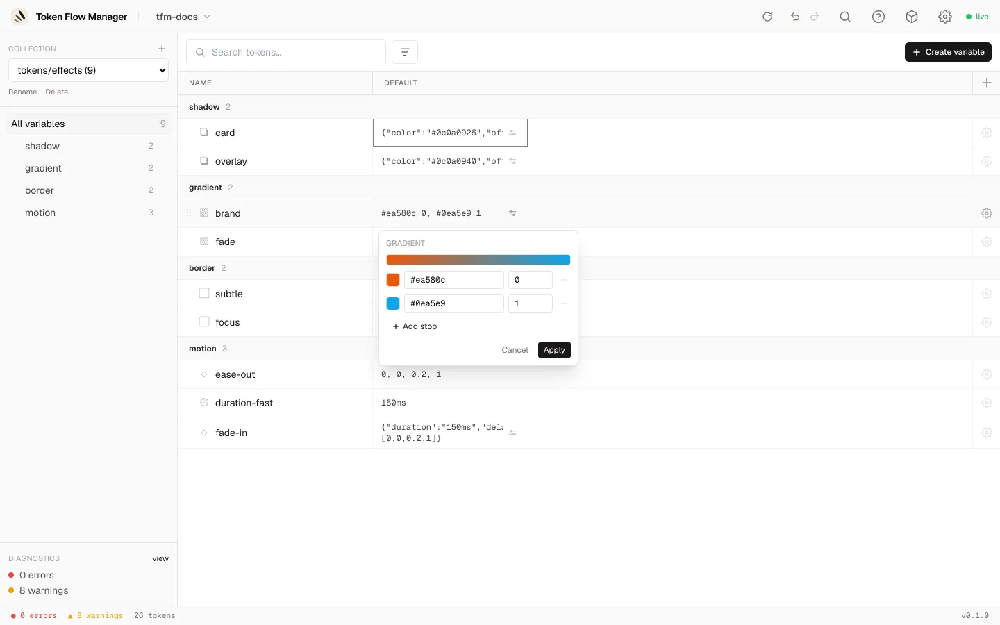

# Types de tokens & pickers

Chaque type de token reçoit un éditeur adapté, du simple champ texte au picker de couleur
complet, ou à un éditeur structuré pour les tokens composites.

## Deux dialectes, un seul modèle

Les mêmes tokens circulent sous deux dialectes JSON, et les deux s'ouvrent de la même
façon :

| Sur le disque | Écrit par |
|---|---|
| `$value` / `$type` / `$description` | DTCG 2025.10, la spec |
| `value` / `type` / `description` | le plugin Figma Tokens Studio |

Le dialecte est détecté token par token, donc un fichier mixte fonctionne aussi, et le
panneau de diagnostics indique ce qui a été trouvé. Deux règles comptent en pratique :

- **Un fichier est réécrit dans son propre dialecte.** Modifier un token d'un fichier
  Tokens Studio réécrit ce seul `value` et rien d'autre : le fichier continue de
  fonctionner avec le plugin Figma. Un token que vous y créez est écrit de la même façon,
  sous le nom attendu par le plugin (`boxShadow`, pas `shadow`).
- **Seuls les *noms de types* sont traduits, jamais les valeurs.** `fontSizes` est lu
  comme `dimension`, `boxShadow` comme `shadow`, `lineHeights` et `opacity` comme
  `number`, `fontFamilies` et `fontWeights` comme `fontFamily` et `fontWeight`. Une ombre
  conserve ses champs `x` / `y` / `spread`, une hauteur de ligne conserve `"150%"`. Les
  noms sans équivalent DTCG (`textCase`, `textDecoration`, `composition`, `asset`,
  `other`) restent non typés et intacts.

Les valeurs arithmétiques comme `"{fontSize.base} * 0.75"` sont conservées telles quelles
plutôt qu'évaluées, et les références qu'elles contiennent comptent comme des références :
renommer `fontSize.base` met à jour toutes les expressions qui le visent.

## Types simples

Édités en ligne dans le tableau (double-clic sur une cellule, ou Entrée sur une cellule
sélectionnée) : `color` ouvre le picker de couleur, `dimension` et `number` un champ texte
avec incréments ↑/↓, `fontFamily`, `fontWeight`, `duration` et `strokeStyle` un champ
texte, et `cubicBezier` ses quatre nombres `[x1, y1, x2, y2]`.

## Picker de couleur

Cliquez sur une cellule de couleur pour ouvrir le picker. Il a deux onglets : **Custom**
(saisir votre propre valeur) et **Libraries** (référencer un autre token).

=== "RGB"

    Carré saturation/valeur, curseurs de teinte et d'alpha, une pipette, et saisie HEX
    ou RGB.

    

=== "OKLCH"

    Curseurs de luminosité, chroma et teinte avec badges de gamut sRGB / P3 en direct,
    et sortie en OKLCH, Display P3 ou HEX.

    

=== "Libraries (alias)"

    Recherchez et choisissez un autre token à référencer. Les tokens couleur affichent
    une pastille et leur valeur résolue.

    

## Tokens composites

Les tokens composites (objets ou tableaux) ont un éditeur structuré **déplié sur
place**. Cliquez sur l'**icône curseurs** d'une cellule composite. Chaque champ reçoit
le bon contrôle : les champs couleur ouvrent le picker, les dimensions et nombres sont
des champs texte, et vous pouvez référencer chaque champ individuellement.

=== "Shadow"

    `color`, `offsetX`, `offsetY`, `blur`, `spread`.

    

=== "Gradient"

    Une barre de prévisualisation et une liste de stops (couleur + position), avec
    **Add stop**.

    

=== "Typography"

    `fontFamily`, `fontWeight`, `fontSize`, `lineHeight`, `letterSpacing` et plus.
    Chaque champ peut être une valeur littérale ou un alias.

    

`border` et `transition` fonctionnent de la même façon, chacun avec ses propres champs.
