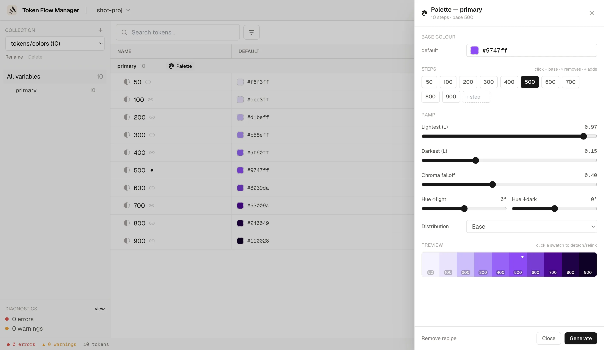

# Fonctionnalités

## Gestion des projets

- **Écran d'accueil** : projets récents (supprimables avec ×) et un sélecteur de
  dossier natif ("Parcourir votre ordinateur…") avec une saisie de chemin en secours.
  Ouvrez un projet depuis l'interface, sans chemin en ligne de commande.
- **Sélecteur de projet** : l'en-tête affiche le nom du projet ouvert avec un chevron ;
  le menu déroulant bascule vers un projet récent sur place ou revient à l'écran
  d'accueil.
- **[Modèles de démarrage](templates.md)** : pas encore de projet ? La carte *Open a
  project* glisse vers un sélecteur qui génère une structure DTCG complète depuis Tailwind
  CSS v4, Material Design 3, Semantic Functional DS ou Simple Design System (collections,
  modes et alias déjà en place), puis l'ouvre et, si vous le souhaitez, enchaîne sur le
  configurateur de distribution.

## Édition des tokens

- **Tableau des variables** : colonnes de modes (clair/sombre/marque et plus), puces
  d'alias, édition en ligne, colonnes redimensionnables.
- **Réordonner les colonnes de modes** : glissez un en-tête de colonne par son libellé.
  Seul l'ordre des modes de la collection change (les fichiers de tokens ne sont pas
  touchés), et le mode le plus à gauche est le mode par défaut de la collection.
- **Arbre de groupes** : glisser-déposer à la Finder. Déposez un groupe sur un autre
  pour l'**imbriquer**, ou entre deux groupes pour **réordonner**. Sélection multiple
  avec ⌘/Ctrl-clic et Maj-clic pour en déplacer plusieurs à la fois.
- **Copier / Couper / Coller des variables** (++cmd+c++ / ++cmd+x++ / ++cmd+v++) :
  couper masque les lignes immédiatement et les déplace au collage ; copier duplique.
- **Copier / Coller une valeur** (++cmd+c++ / ++cmd+v++ sur une cellule focus, ou
  clic droit → *Copy value* / *Paste value*) : la valeur passe par le **presse-papier
  système**, elle circule donc vers une autre cellule, un autre mode ou n'importe quelle
  autre app. Coller sur une multi-sélection remplit toutes les lignes sélectionnées pour
  ce mode d'un coup (un seul annuler).
- **Annuler / Rétablir** (++cmd+z++ / ++cmd+shift+z++) : exact à l'octet, côté serveur.

!!! tip "Une valeur collée est nettoyée et vérifiée"

    Le texte du presse-papier est normalisé (espaces, retours à la ligne, guillemets et
    `;` final retirés) puis validé contre le type de la cellule : `1a2b3c` devient
    `#1a2b3c`, `1600` collé sur `1440px` devient `1600px` (l'unité en place est
    conservée), et `{screen.gutter}` relie la cellule à ce token. Une valeur qui ne
    correspond pas au type est refusée avec un message, au lieu d'être écrite.

## Palettes de couleurs (shading)

Générez et éditez une échelle complète (50 → 900) à partir d'une seule couleur de base —
fini le copier-coller de chaque niveau depuis un outil externe.

Ouvrez l'**éditeur de palette** via l'icône palette sur l'en-tête d'un groupe de couleurs.
Il détecte les niveaux du groupe, prend `500` comme base (ou le niveau du milieu) et
construit une rampe **OKLCH** perceptuellement régulière, réglable en direct :

- **Couleur de base par mode** : chaque mode (clair/sombre, marques…) a sa propre couleur
  d'ancrage, choisie avec le color picker de l'application ; la colonne de chaque mode est
  générée indépendamment.
- **Niveaux** : cliquez un chip pour définir la base, ++x++ pour retirer un niveau, ou
  saisissez un nom pour en ajouter un.
- **Rampe** : luminosité la plus claire / la plus sombre, atténuation du chroma
  (désaturation vers les extrêmes), décalage de teinte et distribution de la luminosité
  (linéaire / ease / …), avec un aperçu en direct.
- **Générer** écrit les tokens de niveau ; la base garde sa couleur exacte.

Un niveau édité à la main devient **détaché** : il est préservé à la régénération (son
aperçu est figé lui aussi) jusqu'à ce que vous le re-liiez. Dans le tableau des variables,
un groupe piloté par une recette affiche un badge **Palette**, le niveau de base un
marqueur ◆, et les niveaux générés une icône de lien.

!!! tip "Les recettes survivent à un aller-retour Figma"

    La recette de shading (base, niveaux, courbe) est stockée dans
    `tokenflow.config.json` — un fichier versionné, propre à l'outil, qui n'est **jamais
    envoyé à Figma**, donc un export ne peut pas l'effacer (Figma n'a pas de notion de
    groupe pour la porter). Les niveaux générés, eux, sont des tokens couleur DTCG
    ordinaires et portables.

## Rechercher et corriger

- **Recherche** (++cmd+s++) et filtres : alias, dépréciés, orphelins, erreurs, ainsi
  qu'une **palette de commandes**.
- **Diagnostics** avec corrections en un clic.
- **Inspecteur** avec chaînes d'alias et références entrantes.
- **Aide des raccourcis clavier** (++cmd+slash++ ou ++question++) et la version de
  l'application dans le pied de page.

## Inspecteur & extensions

Ouvrez le panneau de détail d'un token avec l'**icône engrenage** sur sa ligne. Il
affiche la description, les valeurs par mode (avec couleur résolue, OKLCH et gamut), les
références entrantes, le renommage et l'emplacement du fichier source.

Lorsqu'un token porte des **`$extensions`** DTCG — par exemple le bloc `com.figma`
exporté par Figma (variable id, collection id, mode id, type résolu, scopes…) — celles-ci
sont préservées à la lecture et affichées dans une section **Extensions** dédiée. Chaque
bloc vendeur est rendu en lignes clé/valeur lisibles, avec un bouton **View JSON** pour la
charge brute. Les extensions restent intactes à travers les éditions et les écritures.

## Modèle de sûreté

!!! info "Il ne commit jamais"

    Token Flow Manager modifie le JSON source **sur place**, de façon atomique, en
    préservant l'ordre des clés et le formatage. Le serveur reste local à votre machine,
    surveille les fichiers, et conserve des sauvegardes tournantes à l'écriture.

- [x] Écritures atomiques préservant le formatage
- [x] Résolution des alias entre collections et modes (cycles, références cassées détectés)
- [x] Conforme DTCG 2025.10
- [x] 100 % local, rien ne quitte votre machine
