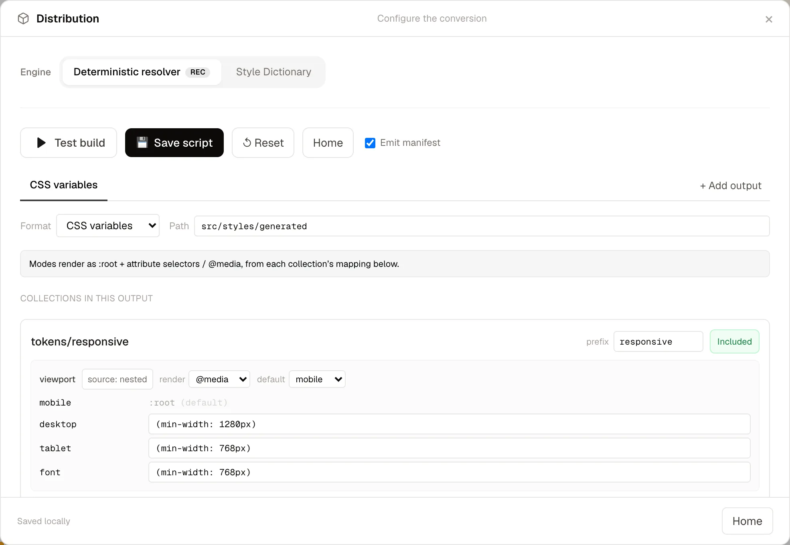
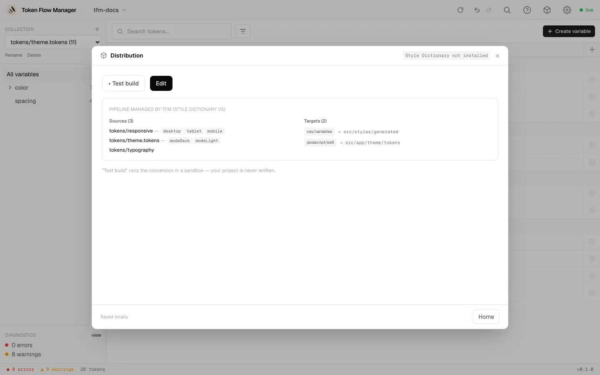

# Distribution

Distribution turns your tokens into real output files (CSS variables, SCSS, TypeScript,
JSON) using [Style Dictionary](https://styledictionary.com). Open it from the **package
icon** in the header.

You get two paths: let the assistant **configure the conversion** for you, or **link an
existing build** you already have.

## Configure the conversion (assistant)

A three-step wizard: **Variants**, **Outputs**, **Build & test**.

1. **Variants**: confirm the variants (modes / theme files) detected per collection.
2. **Outputs**: choose what to generate and where. For each target you set a format, a
   destination path, an optional prefix, and a render strategy per collection (CSS
   selectors, media queries, separate files, or a single flat file).
3. **Build & test**: run a **Test build** (sandboxed, nothing is written) and review the
   report, then **Save build** to write the script and an npm script into your project.

## Overview

Once a pipeline is saved, the Distribution dialog shows its summary: sources and their
variants, the targets and destinations, and a **Test build** button. Use **Edit** to
reopen the assistant.

!!! note "Test build vs. real build"

    **Test build** runs the conversion in a sandbox and never writes to your project.
    The saved npm script (e.g. `npm run build:tokens`) is what actually writes the
    output files.

## Link an existing build

Already have a Style Dictionary (or other) config and build command? Choose **I already
have my config** to point the tool at your config file and build command. Running a
linked build executes your real command and writes its output files to disk.
