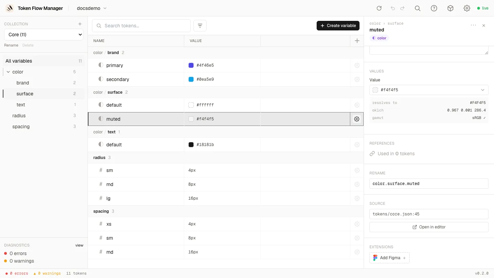
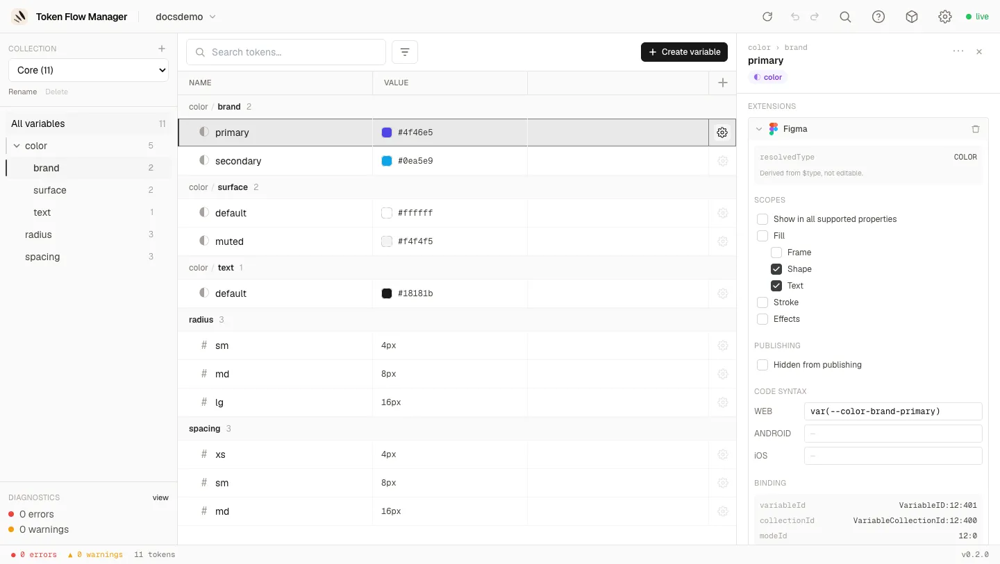
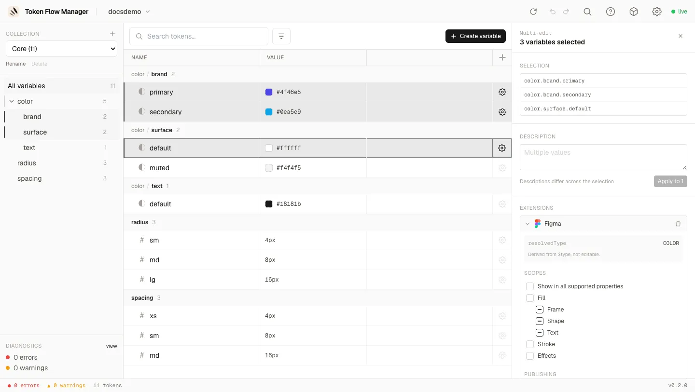

# Bulk edit & extensions

Two things are rarely true of a single variable: a description, and the metadata a design
tool needs. *"These twelve radius variables must be scoped to corner radius"* and *"these
twenty variables share the same description"* are the normal cases, so both are editable
across a **multi-selection**, and vendor **`$extensions`** are now **writable**, not just
readable.

## Extensions are a list of services

A token's DTCG `$extensions` block is an open namespace: each vendor owns a key and puts
whatever it needs under it. The **Extensions** section reflects exactly that. It lists the
**services** attached to the variable, one collapsible card each, rather than a wall of
fields:

- Each card carries the service **logo**, its name, a **count** (`1/2`) when only part of
  the selection has it, and a **remove** button.
- Cards **collapse**, so a variable carrying several services stays readable.
- Services are **cumulative**: Figma and any other vendor coexist on the same variable.
- A vendor with no editor yet is shown **read-only** as formatted JSON, and is never
  altered by an edit elsewhere.

Figma is the first service with a real editor. Others can be added later without changing
anything you see here: a new service simply appears as one more card, with its own fields
and its own **Add** button.

### Adding and removing a service

A variable created in the tool (or one never pushed to a design tool) carries no extension
at all. Rather than showing empty Figma fields, the section offers the services you can
**add**:

Adding writes the minimum the service needs, and only to the variables that lack it (the
`1/2` on the card tells you how many). Removing deletes that vendor's block. Both are a
**single undo** away.

!!! tip "The service card only edits what carries it"

    Ticking a scope never creates the block on a variable that has none: those go through
    **Add Figma** explicitly. It keeps a bulk edit from silently converting unrelated
    variables into Figma variables.

## The Figma service

Open a variable exported from Figma and its `com.figma` block becomes an editor:

### Scopes

The [scope list](https://developers.figma.com/docs/plugins/api/VariableScope/) mirrors the
Figma UI, including the hierarchy (**Fill** parent of **Frame** / **Shape** / **Text**) and
the exclusivity of **Show in all supported properties**, which greys the rest out.

**The list depends on the variable type.** A colour offers fills, stroke and effects; a
number offers corner radius, gap, sizes and the typography scales. That is derived from the
token's `$type`, so you can only ever assign a scope Figma would accept.

### Field roles

Not every field in a vendor block means the same thing, so they are not all editable:

| Field | Role | In the UI |
| --- | --- | --- |
| `scopes`, `hiddenFromPublishing`, `codeSyntax` | **Editable** | Full controls |
| `resolvedType` | **Derived** from the token's `$type` | Read-only, with a **Fix** action when the stored value disagrees |
| `variableId`, `collectionId`, `modeId` | **Binding identity** | Read-only |

!!! warning "Identities are not editable, on purpose"

    `variableId` and friends are what binds the token to a real Figma variable. Editing one
    would silently rewrite a *different* variable on the next import. The server rejects it
    too, so no client can write it. `resolvedType` is refused the same way when it
    contradicts the `$type`: Figma would reject the file on import.

## Multi-selection

Select several rows (++cmd++ or ++shift++ click), right-click, and pick **Edit N
variables**. The panel takes the place of the detail panel and edits the whole selection:

### Description

The field shows **Multiple values** when they differ, and nothing is written until you edit
it and press **Apply to N**. The counter says how many rows would actually change, so
opening the panel by mistake can never blank twenty descriptions.

### Tri-state scopes

Each checkbox has three states across the selection:

- **checked**: every concerned variable has the scope
- **empty**: none has it
- **indeterminate**: some do

Clicking from indeterminate **adds** the scope to all of them; clicking a checked box
**removes** it from all of them. What you do not click is not touched, so a bulk edit is
additive by scope rather than a wholesale replacement.

### Mixed types

Selecting a colour and a dimension together shows the **union** of both scope lists, with a
`1/2` counter on the lines that only apply to part of the selection. Only the concerned
variables are written.

## Under the hood

- Every bulk edit is **one transaction**: validated entirely before anything is written,
  one parse/write per file, and **one undo item** for the lot (`Describe 3 variables`,
  `Edit extensions on 2 variables`).
- Writes are **key-level merges**, never a block replacement. It matters when a collection
  folds its modes into path segments: `modeId` is per mode while `scopes` are per token, so
  replacing the block would break the binding.
- Scopes are written in a **canonical order** with the `ALL_SCOPES` exclusivity applied
  server-side, so the diff stays stable whatever the client sent.
