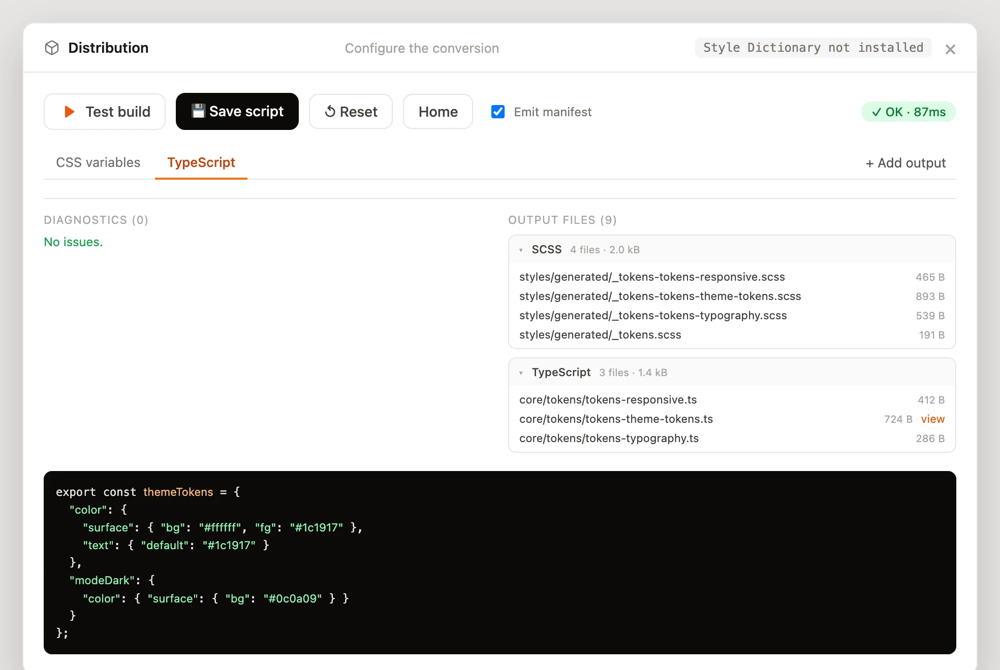

# Distribution

La distribution transforme vos tokens en fichiers de sortie (variables CSS, SCSS,
TypeScript, JSON). Ouvrez-la depuis l'**icône paquet** dans l'en-tête.

Depuis la v0.1.4, l'assistant repose sur un **résolveur déterministe** (sans Style
Dictionary) : sa sortie est identique quelle que soit la topologie d'entrée - modes
imbriqués dans un seul fichier (`grey.modeBrand1.900`) **ou** un fichier par mode
(`primitives.brand1.json`) - et les références inter-collections restent en `var(--…)`
en CSS/SCSS (résolues en valeurs littérales en TypeScript/JSON). Le changement de
marque/thème se fait donc à l'exécution via des sélecteurs, sans duplication.

Deux chemins : laisser l'assistant **configurer la conversion**, ou **relier un build
existant** que vous avez déjà.

## Configurer la conversion

L'éditeur a deux parties : **Outputs** (où et dans quel format) et **Collections &
modes** (quoi, et comment chaque mode est écrit). Un **Test build** en bac à sable ne
touche jamais votre projet ; **Save script** écrit un `tokens.build.mjs` autonome plus un
script npm.


### Outputs (onglets)

Chaque **output** est un émetteur : un **format**, un dossier de **destination** et les
**collections** qu'il écrit. Ajoutez-en autant que nécessaire : les mêmes tokens peuvent
être émis en plusieurs formats vers des dossiers différents (par exemple SCSS vers
`src/styles/generated` **et** TypeScript vers `src/app/core/tokens`). Chaque output est un
onglet ; **+ Add output** en crée un, et le menu de format renomme son onglet.

Formats disponibles :

| Format | Ce qu'il produit |
|---|---|
| **CSS variables** | Propriétés personnalisées sous `:root` + sélecteurs d'attribut / `@media` (wrap). |
| **SCSS variables** | `$variables` à plat (casse préservée). Pas de sélecteurs - idéal pour les breakpoints. |
| **SCSS mixin** | Une map `$…-themes` + un `@mixin` émettant des variables CSS, avec des classes d'activation par marque. |
| **TypeScript** | Objets imbriqués, modes en clés ; références résolues en valeurs littérales. |
| **JSON** | JSON imbriqué, modes en clés ; références résolues. |

Dans un onglet, chaque collection a un interrupteur **Included / Ignored**, pour qu'un
output n'émette que les collections voulues (ex. un output **SCSS variables** à plat juste
pour `breakpoints`).

### Collections & modes

L'assistant **détecte automatiquement** la topologie de modes de chaque collection
(segments de chemin imbriqués vs. un fichier par mode) et propose un mapping éditable
**mode → sélecteur** : sélecteurs d'attribut pour marque/thème, `@media` pour le viewport,
avec un mode par défaut rendu dans `:root`. Ce mapping est défini une seule fois par
collection et **chaque format l'interprète** :

- **CSS variables / SCSS mixin** utilisent les sélecteurs / conditions media.
- **TypeScript / JSON** transforment les modes en clés d'objet imbriquées.
- **SCSS variables** (à plat) ignorent les sélecteurs (le mode par défaut l'emporte).

### Build & test

**Test build** exécute la conversion en bac à sable et liste les diagnostics et les
fichiers produits, groupés par format : rien n'est écrit dans votre projet. Toute
référence non résolue est listée en avertissement (et émise en commentaire
`/* unresolved: … */`, jamais un `{token}` brut). **Save script** écrit un partial par
collection, un index et un `tokens.manifest.json` **dans chaque destination d'output**,
plus un script npm, **sans aucune dépendance** d'exécution.



Vous pouvez aussi télécharger le résultat sans rien écrire : **⬇ .zip** sur un groupe, ou
**⬇ Download all (.zip)**.

## Exemples de sortie

Une collection de couleurs multi-modes émise en **SCSS mixin** produit une map de thèmes
et un générateur :

```scss
$sem-themes: (
  "modeLight": ( "sem-surface-bg": #ffffff, "sem-text-default": #1c1917 ),
  "modeDark":  ( "sem-surface-bg": #0c0a09, "sem-text-default": #fafafa ),
);

@mixin sem-apply($name) {
  $base: map-get(map-get($sem-themes, $name), "modeLight");
  @each $n, $v in $base { --#{$n}: #{$v}; }
}
:root { @include sem-apply("modeLight"); }
```

Les mêmes tokens émis en **TypeScript** inlinent les références en littéraux, modes en
clés :

```ts
export const themeTokens = {
  "color": { "surface": { "bg": "#ffffff" }, "text": { "default": "#1c1917" } },
  "modeDark": { "color": { "surface": { "bg": "#0c0a09" } } }
} as const;
```

!!! note "Test build vs. build réel"

    **Test build** s'exécute en bac à sable et n'écrit jamais dans votre projet. Le script
    npm enregistré (ex. `npm run tokens:build`) est ce qui écrit réellement les fichiers.

## Relier un build existant

Vous avez déjà une config Style Dictionary (ou autre) et une commande de build ? Choisissez
**I already have my config** pour pointer l'outil vers votre fichier de config et votre
commande. Lancer un build relié exécute votre vraie commande et écrit ses fichiers sur le
disque.
