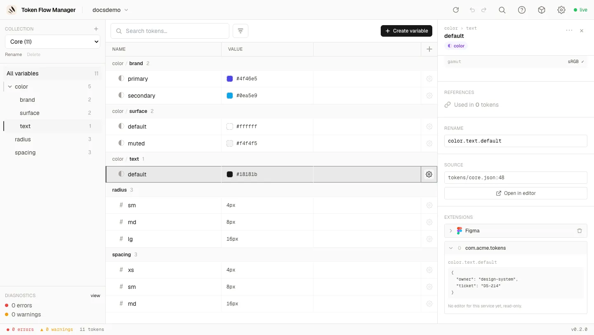

# Multi-édition & extensions

Deux choses sont rarement propres à une seule variable : une description, et les métadonnées
dont un outil de design a besoin. *« Ces douze variables de radius doivent être scopées sur
le corner radius »* et *« ces vingt variables partagent la même description »* sont les cas
courants, donc les deux s'éditent sur une **multi-sélection**, et les **`$extensions`**
vendeur sont désormais **écrites**, plus seulement lues.

## Les extensions sont une liste de services

Le bloc `$extensions` DTCG d'un token est un espace de noms ouvert : chaque vendeur possède
une clé et y met ce dont il a besoin. La section **Extensions** reflète exactement cela.
Elle liste les **services** attachés à la variable, une carte repliable par service, plutôt
qu'un mur de champs :

- Chaque carte porte le **logo** du service, son nom, un **compteur** (`1/2`) quand une
  partie seulement de la sélection le possède, et un bouton de **suppression**.
- Les cartes se **replient**, donc une variable portant plusieurs services reste lisible.
- Les services sont **cumulables** : Figma et un autre vendeur cohabitent sur la même variable.
- Un vendeur sans éditeur s'affiche en **lecture seule** (JSON formaté), et n'est jamais
  altéré par une modification ailleurs.

Figma est le premier service doté d'un véritable éditeur. D'autres pourront s'ajouter plus
tard sans rien changer à ce que vous voyez ici : un nouveau service apparaît simplement
comme une carte de plus, avec ses champs et son propre bouton **Add**.

### Ajouter et retirer un service

Une variable créée dans l'outil (ou jamais poussée vers un outil de design) ne porte aucune
extension. Plutôt que d'afficher des champs Figma vides, la section propose les services que
vous pouvez **ajouter** :

L'ajout écrit le minimum dont le service a besoin, et uniquement sur les variables qui ne
l'ont pas (le `1/2` de la carte indique combien). La suppression retire le bloc de ce
vendeur. Les deux tiennent en **une seule annulation**.

!!! tip "La carte n'édite que ce qui la porte"

    Cocher un scope ne crée jamais le bloc sur une variable qui n'en a pas : celles-ci
    passent explicitement par **Add Figma**. Cela évite qu'une édition groupée transforme en
    silence des variables sans rapport en variables Figma.

## Le service Figma

Ouvrez une variable exportée depuis Figma et son bloc `com.figma` devient un éditeur :

### Scopes

La [liste des scopes](https://developers.figma.com/docs/plugins/api/VariableScope/) reprend
l'UI de Figma, hiérarchie comprise (**Fill** parent de **Frame** / **Shape** / **Text**) et
exclusivité de **Show in all supported properties**, qui grise tout le reste.

**La liste dépend du type de la variable.** Une couleur propose les remplissages, le contour
et les effets ; un nombre propose le corner radius, le gap, les tailles et les échelles
typographiques. C'est dérivé du `$type` du token, vous ne pouvez donc assigner qu'un scope
que Figma accepterait.

### Rôles des champs

Tous les champs d'un bloc vendeur n'ont pas le même statut, ils ne sont donc pas tous
éditables :

| Champ | Rôle | Dans l'interface |
| --- | --- | --- |
| `scopes`, `hiddenFromPublishing`, `codeSyntax` | **Éditable** | Contrôles complets |
| `resolvedType` | **Dérivé** du `$type` du token | Lecture seule, avec une action **Fix** quand la valeur stockée diverge |
| `variableId`, `collectionId`, `modeId` | **Identité de binding** | Lecture seule |

!!! warning "Les identités ne sont pas éditables, volontairement"

    `variableId` et consorts sont ce qui lie le token à une vraie variable Figma. En éditer
    un réécrirait silencieusement une *autre* variable au prochain import. Le serveur le
    refuse également, donc aucun client ne peut l'écrire. `resolvedType` est refusé de la
    même façon lorsqu'il contredit le `$type` : Figma rejetterait le fichier à l'import.

## Multi-sélection

Sélectionnez plusieurs lignes (clic ++cmd++ ou ++shift++), clic droit, puis **Edit N
variables**. Le panneau prend la place du panneau de détail et édite toute la sélection :

### Description

Le champ affiche **Multiple values** quand elles diffèrent, et rien n'est écrit tant que
vous ne l'avez pas modifié puis validé par **Apply to N**. Le compteur indique combien de
lignes changeraient réellement : ouvrir le panneau par erreur ne peut pas vider vingt
descriptions.

### Scopes à trois états

Chaque case a trois états sur la sélection :

- **cochée** : toutes les variables concernées ont le scope
- **vide** : aucune ne l'a
- **indéterminée** : certaines l'ont

Cliquer depuis l'état indéterminé **ajoute** le scope à toutes ; cliquer une case cochée le
**retire** de toutes. Ce que vous ne cliquez pas n'est pas touché : l'édition groupée est
additive scope par scope, pas un remplacement global.

### Types hétérogènes

Sélectionner une couleur et une dimension ensemble affiche l'**union** des deux listes de
scopes, avec un compteur `1/2` sur les lignes qui ne concernent qu'une partie de la
sélection. Seules les variables concernées sont écrites.

## Sous le capot

- Chaque édition groupée est **une transaction** : validée intégralement avant toute
  écriture, un parse/write par fichier, et **un seul item d'annulation** pour le lot
  (`Describe 3 variables`, `Edit extensions on 2 variables`).
- Les écritures sont des **fusions clé par clé**, jamais un remplacement de bloc. C'est
  décisif quand une collection replie ses modes en segments de chemin : `modeId` est par
  mode alors que `scopes` est par token, remplacer le bloc casserait le binding.
- Les scopes sont écrits dans un **ordre canonique**, l'exclusivité `ALL_SCOPES` étant
  appliquée côté serveur : le diff reste stable quoi qu'envoie le client.
